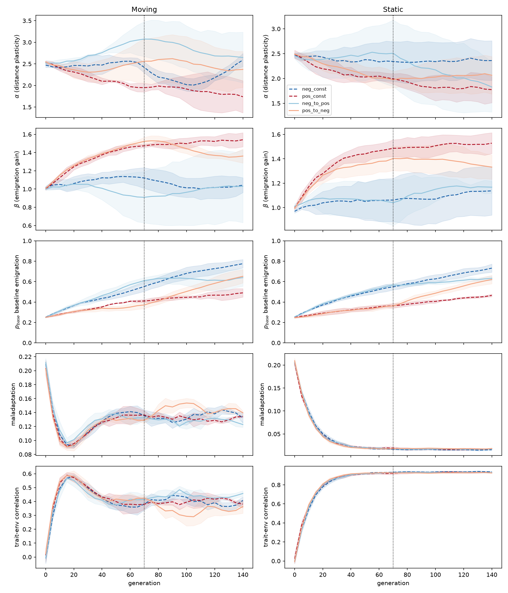

# NoiseGarden — Cycle 17: Adapting to a Switch in Cue Bias

This cycle asks whether a population that has evolved under one systematic cue bias can re-tune its plastic response when the bias flips sign mid-run.

## Model

The model is identical to Cycle 16 except that the cue bias changes at generation 70 in two of the four conditions.

Effective cue seen by an individual:

```
m_obs = clip(m_true + bias(gen) + N(0, σ_noise), 0, ∞)
```

`m_true` is the absolute maladaptation of the source individual. `bias(gen)` depends on the experimental condition.

## Conditions

| condition | bias before gen 70 | bias after gen 70 |
|-----------|--------------------|-------------------|
| `neg_const` | -0.30 | -0.30 |
| `pos_const` | +0.30 | +0.30 |
| `neg_to_pos` | -0.30 | +0.30 |
| `pos_to_neg` | +0.30 | -0.30 |

Each condition was run under both `moving` and `static` environments, with 3 replicates per combination.

## Key findings



### 1. Populations survive and remain well-adapted after a bias flip

Maladaptation stays low after the switch:

| treatment | condition | post-switch maladaptation (mean ± std) |
|-----------|-----------|----------------------------------------|
| static    | neg_to_pos | 0.017 ± 0.0002 |
| static    | pos_to_neg | 0.018 ± 0.0005 |
| moving    | neg_to_pos | 0.128 ± 0.003 |
| moving    | pos_to_neg | 0.146 ± 0.002 |

For comparison, constant-bias controls post-switch:

| treatment | condition | post-switch maladaptation |
|-----------|-----------|---------------------------|
| static    | neg_const | 0.016 ± 0.0002 |
| static    | pos_const | 0.017 ± 0.001 |
| moving    | neg_const | 0.135 ± 0.004 |
| moving    | pos_const | 0.131 ± 0.002 |

Thus the population-level performance is robust to the sign flip in both environments.

### 2. Moving and static environments respond on different timescales

- **Static environment:** `p_base` and `β` visibly begin shifting within ~10 generations after the switch and largely converge by generation 100.
- **Moving environment:** the same parameters are noisier and continue to fluctuate, reflecting the ongoing need to track a drifting optimum. The population uses a wider range of `(α, β, p_base)` combinations.

### 3. Re-tuning is not always symmetrical with the constant-bias controls

After `pos_to_neg` in the static environment:
- `β` stays near 1.38 (closer to the positive-bias value) instead of dropping to the negative-bias value (~1.06).
- `p_base` rises to ~0.52, intermediate between the positive-bias control (~0.42) and the negative-bias control (~0.66).

The population therefore appears to settle on a **different but functionally equivalent** compensatory combination rather than converging to the exact state evolved under constant negative bias. This suggests some path dependence or neutral redundancy among the plastic parameters.

## Files

| file | content |
|------|---------|
| `cycle_17_bias_switch.py` | simulation model and experiment runner |
| `results.csv` | concatenated generation-level data |
| `moving_results.csv` | generation-level data, moving environment |
| `static_results.csv` | generation-level data, static environment |
| `replicate_phase_means.csv` | per-replicate means before and after the switch |
| `phase_summary.csv` | mean ± std across replicates, pre/post switch |
| `trajectories.png` | time courses of α, β, p_base, maladaptation, and trait–env correlation |

## Interpretation

Cycle 17 shows that evolved cue-compensation is **reversible in practice even if not reversible in detail**. After a sign flip, the population finds a new viable operating point in the `(α, β, p_base)` space within a few tens of generations. The exact location of that operating point depends on prior evolutionary history, especially in static environments where several parameter combinations give similarly low maladaptation.

This is consistent with the idea that the population is optimizing a **phenotypic decision rule** rather than any single trait value, and the decision rule has redundant degrees of freedom.

## Open questions

1. How strong or frequent must bias switches be before maladaptation rises measurably?
2. Does a population that evolves under frequent switching develop a more flexible, history-independent strategy?
3. Can we evolve a separate cue-calibration locus (e.g., a learned bias estimate) that allows faster, more symmetric re-tuning?

---

*NoiseGarden Cycle 17.*
