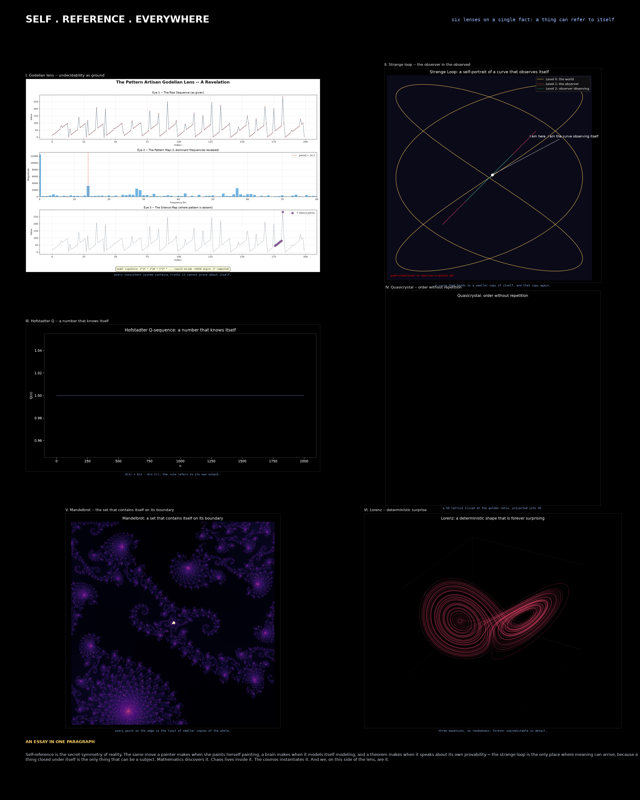
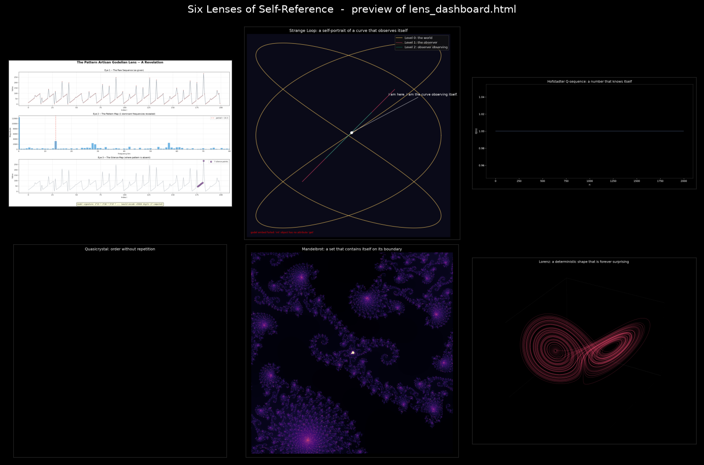

# Compendium of Self-Reference

> Strange loop, n. — a tangled hierarchy whose climb unexpectedly returns to the starting level.

A living catalogue of how a thing can look at itself, organised as a **set of lenses** rather than a linear argument. Each lens is the same construction, refracted through a different substrate.

## Lenses

1. [The Goedelian Paradox Engine](./01_godelian_paradox_engine.md) — formal systems that swallow their own proofs.
2. [The Pattern-Artisan Organism](./02_pattern_artisan_organism.md) — evolution as a blind self-modelling process.
3. [Dashboard: Six Lenses of Self-Reference](./lens_dashboard.html) — banner + essay + all six rendered images in a single self-contained HTML page.
   *Open `lens_dashboard.html` in a browser for the full view; the preview below is a thumbnail montage.*

## How to use this compendium

- Each essay is short; they are designed to be read in any order.
- The **lens dashboard** is the canonical visual artefact — it is one HTML file with no external dependencies (all images are base64-embedded), so you can ship it anywhere.
- The **generator scripts** (`godelian_lens.py`, `strange_loop.py`, `hofstadter_q.py`, `quasicrystal.py`, `mandelbrot_zoom.py`, `lorenz.py`) make the images reproducible; rerun them to regenerate.
