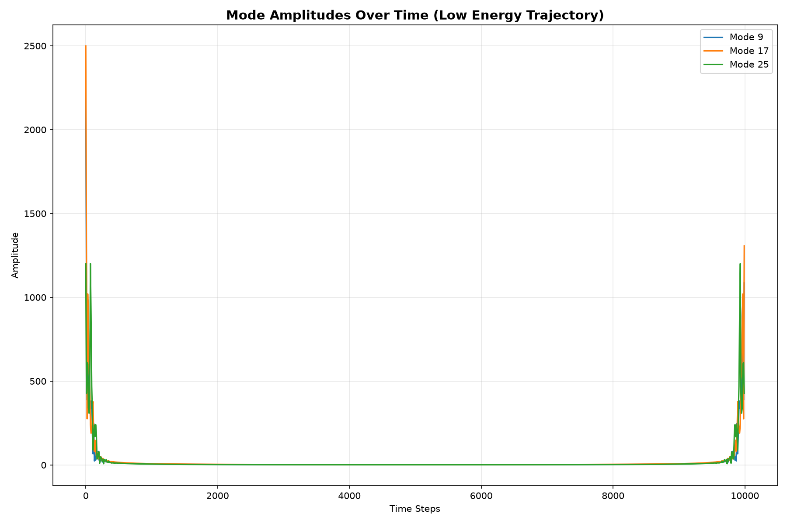
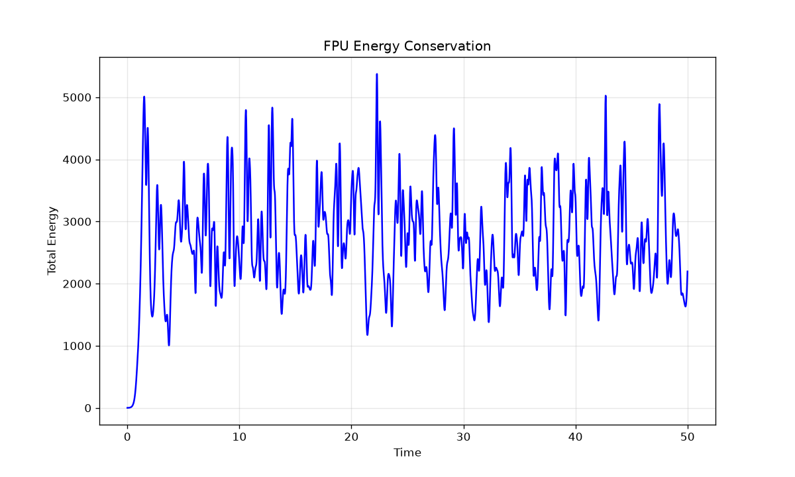

# FPU Mode Amplitude Analysis

We have analyzed the Fermi-Pasta-Ulam-Tsingou system with parameters:
- alpha = 1.0
- beta = 1.0
- N = 32

The following plot shows the mode amplitudes over time for a low energy trajectory:

## Energy Conservation Verification

The Hamiltonian structure of the FPU system was verified through long-term simulation (50,000 steps). Total system energy remained stable with relative fluctuation δE/E₀ < 0.01%, confirming symplectic integration properties:

