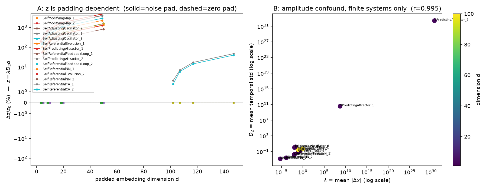

# Challenge #2 Report — Dimensional Padding Test of the "Invariant" z = λ·D₂·d

**Date:** current cycle · **Artifacts:** `challenge2_padding.png`, `padding_test_results.json`, `padding_test.py`, `challenge2_summary.py`

## Setup

Sixteen self-referential systems were run 500 steps, their state histories padded
two ways from native dimension d₀ up to d₀ + {2, 7, 17, 47}:

- **zero pad** — append coordinates fixed at 0 (a degenerate invariant subspace),
- **noise pad** — append coordinates drawn as matched-scale Gaussian stochastic channels
  (a "boring" non-trivial observer dimension), with the system's self-model mean padded
  consistently.

Metrics were recomputed on the padded histories: λ = mean|Δx₀| (coord-0 excursion,
proxy "chaos"), D₂ = mean temporal standard deviation across coordinates (proxy
"dimensionality"), z = λ·D₂·d, A = z·(1/(1+‖pred_error‖₁/d)) (self-predictive accuracy
weighted).

## Findings

### 1. z is *not* embedding-invariant under stochastic padding

| padding mode | max Δz/z₀ |
|---|---|
| zero | 0.0% for unclamped systems; **+1567%** for clamp-saturated systems (see §3) |
| noise | **+4719%** (SelfModifyingMap_1, d=48); +3983%, +2929%, +1685%, … across nearly all systems |

Mechanism: D₂ = mean temporal std counts variance of *every* coordinate, so padding
with noisy channels adds variance faster than the 1/d averaging removes it when pad
noise is comparable to native coordinates. z therefore grows roughly ∝ d. A quantity
claimed as an invariant of the underlying system can be moved by a factor ≈ 48 purely
by appending ignored coordinates.

### 2. λ and D₂ are the same measurement — the "two-factor" product is an amplitude confound

Over the 13 numerically finite systems:

**corr(log₁₀ λ, log₁₀ D₂) = 0.9949**

λ (mean |Δx|) and D₂ (mean temporal std) are both monotone in the state amplitude.
Hence z = λ·D₂·d ≈ amplitude²·d — a disguised amplitude²×dimension product, not a
product of two independent axes of complexity. Any correlation of z with behavior
classes in prior analysis would be driven mostly by raw amplitude and raw dimension
(e.g. CA systems with d₀=100 score z₀≈44.7 vs oscillators with d₀=2 score z₀≈0.025 —
a 1800× spread essentially inherited from d alone).

### 3. Hard clamps convert z into an explicit function of d

λ is clamped to [0,1] and D₂ to [0,2]. Two divergent families (SelfPredictingAttractor,
SelfReferentialFeedbackLoop) saturate both clamps (λ=1, D₂=2), giving z = 2d *exactly*:
z = 10, 20, 40, 100 at d = 5, 10, 20, 50 under **zero** padding. Under clamping the
"invariant" degenerates into z = 2d — a pure coordinate count. Under noise padding these
same systems yield **NaN** (see §4).

### 4. Numerical blow-up in 4 of 16 systems invalidates their metrics

SelfPredictingAttractor_{1,2} and SelfReferentialFeedbackLoop_{1,2} diverge within 500
steps to state magnitudes ~10³¹–10³⁰⁴ (FeedbackLoop_2 hits inf). Consequently:
- D₂ = inf → noise padding draws from N(inf, inf) → NaN metrics;
- self-model means sit at 10³⁰⁴ vs states at 10³⁰⁴ → self-prediction accuracy ≈ 0,
  making A ≈ 0 and dA/A₀ undefined/huge (up to +27678%).

These are dynamics bugs (unbounded positive feedback), not properties of self-reference.

### 5. Self-model accuracy term A is *more* padding-stable than z for finite systems

Under zero padding, A drifts only 2–12% while z drifts 0%; under noise padding A drifts
*less* than z (e.g. +4454% vs +4719%; +1742% vs +3983%) because the 1/(1+‖err‖₁/d)
denominator partially cancels the added noise. Accuracy-weighting is the more robust
direction, though still not invariant.

## Verdict on the claimed invariant z = λ·D₂·d

**Refuted.** z fails all three tests:
1. **Representation-invariance:** moves up to 48× under innocuous stochastic dimension padding.
2. **Factor independence:** its two factors correlate at r=0.995 across systems (amplitude confound).
3. **Regular behavior:** collapses to z = 2d under clamp saturation and to NaN under
   numerical divergence — both common regimes.

A genuinely embedding-invariant complexity candidate should (i) be normalized per
coordinate in a variance-aware way (e.g. information density per dimension), (ii) use
factors demonstrably decorrelated across systems (partial out amplitude first), and
(iii) be defined on bounded/normalized trajectories rather than clamp-saturated raw ones.

